[toc]

# 5장 데이터베이스 설계와 ER모델

## 엔티티 타입 및 애트리뷰트들을 식별

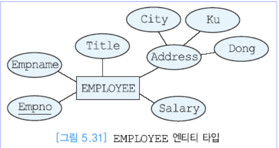

* 각 사원에 대해서 사원번호(고유함), 이름, 직책, 급여, 주소를 저장. 주소는 시, 구, 동으로 세분하여 나타냄

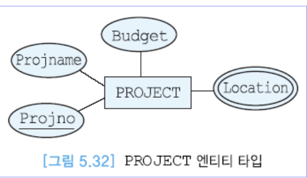

* 회사는 여러 개의 프로젝트들을 진행. 각 프로젝트에 대해서 프로젝트번호(고유함), 이름, 예산, 프로젝트가 진행되는 위치를 나타냄.

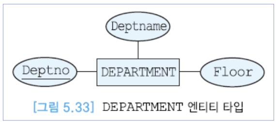

* 부서에 대해서 부서번호(고유함), 이름, 부 서가 위치한 층을 나타냄

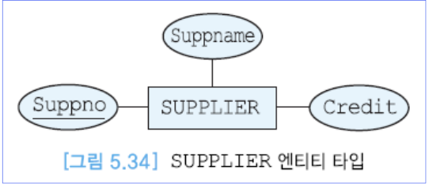

*  공급자에 대해서 공급자번호(고유함), 이름, 신용도를 나타냄

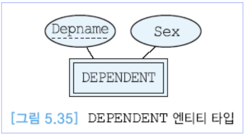

* 부양가족에 대해서 부양가족의 이름과 성별을 저장

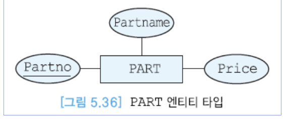

* 부품에 대해서 부품번호(고유함), 이름, 가격, 그 부품이 다른 부품들을 포함하는 경우에는 그 부품들에 관한 정보도 나타냄

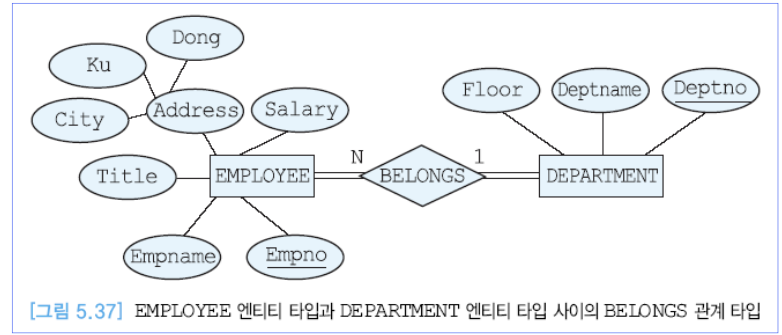

*  사원은 한 부서에만 속함. 각 부서에 대해서 부서번호(고유함), 이름, 부 서가 위치한 층을 나타냄
* 각 사원에 대해서 사원번호(고유함), 이름, 직책, 급여, 주소를 저장. 주소는 시, 구, 동으로 세분하여 나타냄

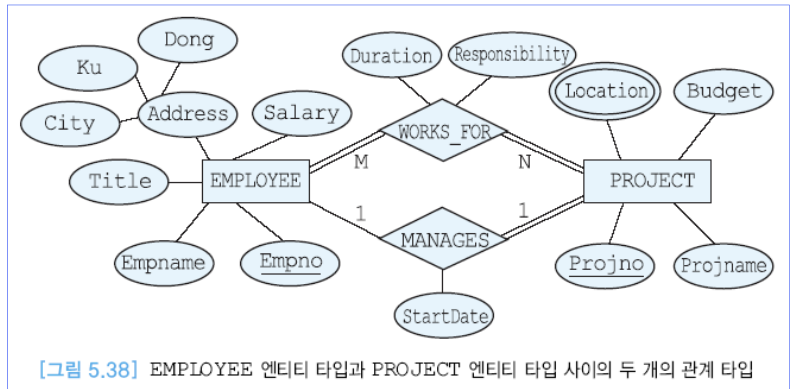

**마름모에 대한 서술**

* 사원은 여러 프로젝트에 서 근무할 수 있음. 각 사원이 해당 프로젝트에서 어떤 역할을 수행하고, 얼마 동안 근무해 왔는가를 나타냄. 
* 각 프로젝트마다 한 명의 프로젝트 관리자가 있음. 한 사원 은 두 개 이상의 프로젝트의 관리자가 될 수는 없음. 프로젝트 관리자 임무를 시작한 날짜를 기록

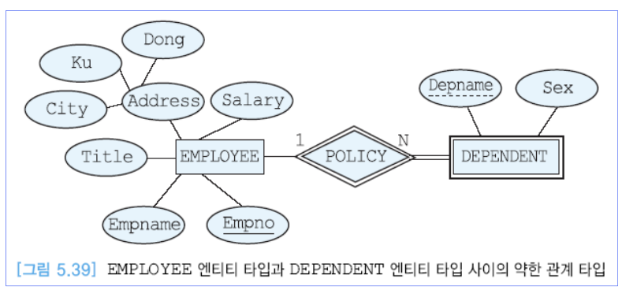

**마름모에 대한 서술**

* 각 사원은 0명 이상의 부양가족을 가질 수 있음. 한 부양가족은 두 명 이상의 사원에 게 속하지 않음. 각 부양가족에 대해서 부양가족의 이름과 성별을 저장

* 약한엔티티타입은 이중직사각형으로 나타냄

* 강한엔티티타입 <<->> 약한엔티티타입 관계를 나타낼때는 식별 관계성 타입으로 표현하기 위해 이중마름모선을 사용함

* 약한엔티티타입은 의존적이기 때문에 무조건 전체참여를 함.

* 강한엔티티타입은 부분참여를 함.

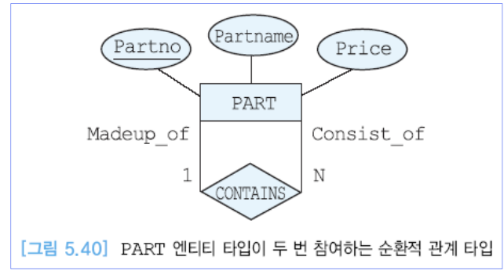

* 각 프로젝트에는 부품들이 필요. 한 부품이 두 개 이상의 프로젝트에서 사 용될 수 있음.

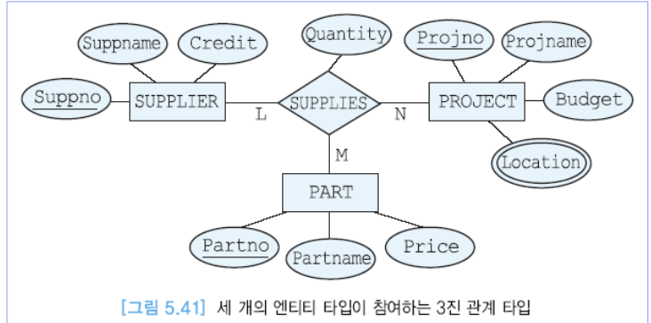

* 부품을 공급하는 공급자들이 있음. 한 명의 공급자는 여러 가지 부품들 을 공급할 수 있고, 각 부품은 여러 공급자들로부터 공급될 수 있음. 
* 각 공급자에 대해서 공급자번호(고유함), 이름, 신용도를 나타냄. 
* 각 공급자에 대 해서 그 공급자가 어떤 부품을 어떤 프로젝트에 얼마나 공급하는가를 나타냄

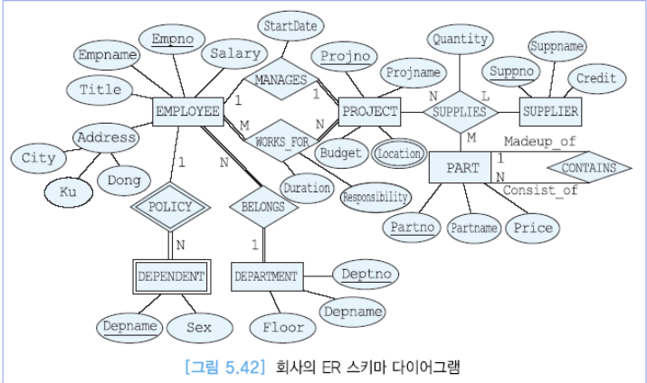

* 위의 요구사항 분석을 바탕으로 ER을 그린 후 추합하면 회사의 ER스키마 다이어그램이 완성된다.